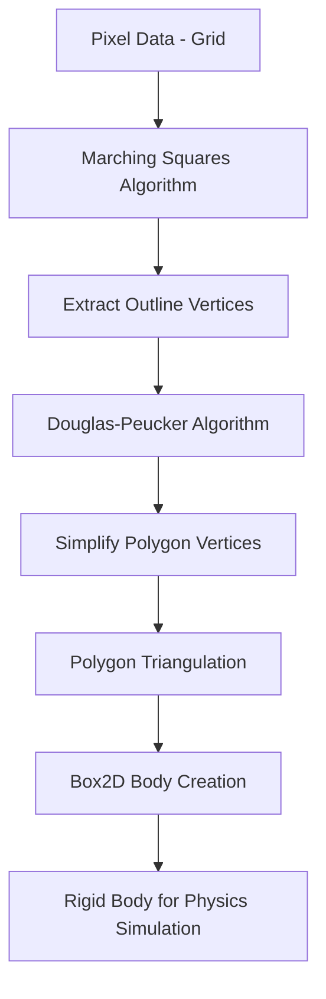
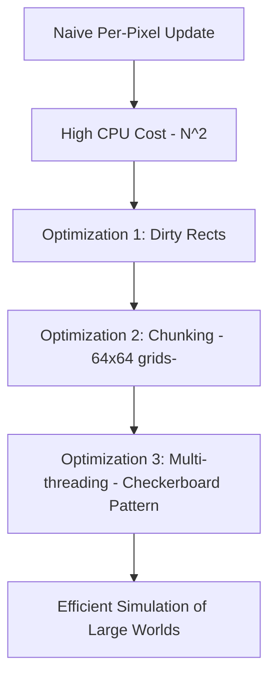

It seems there was an issue with the specific Mermaid parser used, or a slight incompatibility with the chosen node shapes. The error message "got 'PS'" is particularly cryptic as it doesn't directly correspond to the syntax used.

I've revised the Mermaid diagrams to use the most standard and universally compatible rectangle shape `[]` for all nodes in the `graph TD` type. This should resolve the parsing errors.

Here's the updated technical paper with the corrected Mermaid diagrams:

---

## Exploring the Tech and Design of 'Noita': A Deep Dive into Per-Pixel Simulation and Emergent Gameplay

**Author:** Olli Harjola
**Affiliation:** Nolla Games

### Abstract

This paper explores the technical and design journey behind 'Noita', a unique roguelite game where every pixel is simulated. We delve into the custom-built "Falling Everything" engine, detailing its core mechanics for simulating various materials like sand, liquids, and gases, alongside the integration of rigid body physics. The discussion highlights significant technical challenges encountered, particularly concerning performance in a large-scale, dynamic pixel world, and the innovative multi-threading and spatial partitioning solutions implemented. Furthermore, the paper examines the intricate design process of harnessing emergent gameplay, addressing the delicate balance between creating compelling player interactions and managing unpredictable, "game-breaking" chaos. We demonstrate how iterative design, coupled with elements like perma-death and procedural generation, transformed initial challenges into core gameplay strengths, fostering player engagement through communication and strategic adaptation to a truly dynamic environment.

### 1. Introduction

'Noita' is an action roguelite developed by Nolla Games, distinguished by its unique simulation-driven world where every pixel is physically simulated. This core technological choice allows for unprecedented environmental destruction, fluid dynamics, and material interactions, creating a highly dynamic and unpredictable gameplay experience. The development of such a system presented a myriad of technical and design challenges, necessitating a custom engine and an iterative approach to gameplay refinement. This paper aims to dissect these challenges and the solutions devised, providing insights into the technical foundations and design philosophies that underpin 'Noita's' emergent gameplay.

### 2. Foundations of the Simulation

The genesis of 'Noita's' simulation technology can be traced back to early experiments with pixel-based physics. The fundamental concept involves treating each pixel as a discrete entity with properties that dictate its interaction with its environment.

**2.1. Early Inspirations (QuickBASIC):**
The initial fascination with pixel simulation stemmed from simple experiments in QuickBASIC. Using basic `PSET` (put pixel) and `POINT` (get pixel color) commands, rudimentary sand simulations were created: a pixel would check the space directly below it, and if empty, it would move down. If the space below was occupied, it would check diagonal spaces to its left and right, moving into an empty one if available. This simple logic formed the bedrock of the material simulation. Water simulation was a slight variation, incorporating horizontal movement if downward paths were blocked. Gases were essentially an inverse of sand, moving upwards.

**2.2. Evolution in 'Bloody Zombies' (C++ & Particle Systems):**
The concepts were further developed and implemented in C++ for an earlier game, 'Bloody Zombies' (2008). This iteration introduced more complex material behaviors and the integration of a separate particle system.
When a pixel in the main simulation (e.g., blood) was displaced by a player's action (e.g., jumping into it), it would be temporarily removed from the pixel grid and spawned as a separate particle. These particles would then be governed by their own physics (velocity, gravity) and tracked individually. Upon collision with the environment, they would be re-integrated into the main pixel simulation. This dual-system approach allowed for more fluid and dynamic visual effects like blood splatters while maintaining the underlying pixel physics.

### 3. The "Falling Everything" Engine: Technical Deep Dive

The "Falling Everything" engine is a custom solution built to handle 'Noita's' ambitious per-pixel simulation. It combines the fundamental pixel physics with more advanced concepts to create a rich and interactive world.

**3.1. Core Pixel Simulation:**
At its heart, the engine treats the game world as a grid of pixels. Each pixel has a material type (e.g., rock, sand, water, lava, gas, various alchemical liquids, etc.), and these materials have defined behaviors (e.g., falling, flowing, burning, dissolving). The simulation updates these pixels based on their material properties and interactions with neighboring pixels.

**3.2. Integration of Rigid Bodies:**
A significant technical challenge was integrating traditional rigid body physics (for objects like characters, chests, or falling debris) with the granular pixel simulation.
*   **Collision Detection:** Instead of pixels directly interacting with complex rigid body shapes, a process converts the pixel-based world into simplified collision shapes for the rigid body engine.
*   **Deformation & Interaction:** When a rigid body interacts with a pixel-based material, the pixels are dynamically modified. For instance, hitting a block of earth will remove pixels from that block, affecting its shape and potentially spawning new falling sand particles.

The process of generating collision shapes from pixel data for rigid bodies involves several steps:

This pipeline converts the raw pixel data into a simplified polygonal mesh that can be efficiently used by a rigid body physics engine like Box2D. Each pixel belonging to a rigid body also stores its UV coordinates relative to the body's local space, allowing its position to be accurately updated by the rigid body's transformation.

**3.3. Performance Optimization Strategies:**
Simulating every pixel in a large, dynamic world poses immense computational challenges. To achieve acceptable framerates, several key optimizations were crucial:

*   **Dirty Rects:** Instead of updating every pixel in the entire world each frame, the engine tracks "dirty rectangles" – areas where pixels have changed. Only pixels within these dirty rectangles are re-evaluated. This significantly reduces the number of calculations in static areas.
*   **Chunking:** The entire game world is divided into smaller, manageable 64x64 pixel "chunks." This modularity helps with spatial partitioning and reduces the scope of updates. Each chunk maintains its own dirty rects.
*   **Multi-threading (Checkerboard Pattern):** To leverage multi-core CPUs, the pixel simulation is multi-threaded. The challenge with concurrent updates on a shared pixel buffer (single-buffered simulation) is preventing race conditions (where two threads try to modify the same pixel simultaneously). The solution employs a "checkerboard pattern" update:
    *   The world's chunks are divided into two sets, like a checkerboard (e.g., black squares and white squares).
    *   In one frame, all "black" chunks are updated concurrently by different threads. Pixels within a black chunk can only interact with pixels in adjacent "white" chunks.
    *   In the next frame, all "white" chunks are updated.
    *   This ensures that no two threads ever attempt to modify the same pixel at the same time, as adjacent chunks are always of a different "color" and are updated in alternating frames. This allows efficient parallel processing across the world.

### 4. Design Challenges and Solutions: Taming Emergence

While the technical capabilities provided an unparalleled canvas for interaction, translating this into engaging gameplay presented its own set of complex design hurdles.

**4.1. The Double-Edged Sword of Emergence:**
The highly interactive physics engine naturally leads to emergent gameplay – unexpected and complex interactions arising from simple rules. This is often lauded as a desirable trait, as it creates unique and memorable moments. However, it also introduces "game-breaking" scenarios where the simulation creates situations that are unfair, unplayable, or simply not fun. For instance, an early prototype where players could continuously dig through everything with a drill resulted in levels quickly collapsing into a pile of rubble, destroying the carefully crafted level design.

**4.2. Iterative Design & Embracing Chaos:**
The development process became an iterative dance of "trial and error." When an emergent behavior proved detrimental, the team would try to "tame" the "emergent chaos beast" (the physics engine) rather than completely disabling it.

*   **The "Drill" Dilemma:** The powerful digging tool, while fun, disrupted combat as players could simply tunnel away or funnel enemies. Initially, it was removed. The realization was that *removing* mechanics wasn't the answer; *contextualizing* them was.
*   **Rogue-lite as a Solution:** The transition to a roguelite genre with perma-death and procedural generation proved to be a pivotal design choice.
    *   **New World Every Time:** Since each run generates a new world, "screwing up" a level by, for example, flooding it with lava, isn't a permanent setback. The player simply starts a new run in a fresh world. This mitigates the "game-breaking" aspect of destructive physics.
    *   **Player Adaptation:** Instead of memorizing fixed level layouts, players are encouraged to understand the underlying physical rules and adapt their strategies to unpredictable environments. The challenge shifts from mastering a specific scenario to mastering the *system* itself.

**4.3. Communication and Player Attribution:**
Even with procedural generation, player frustration can arise from deaths that feel unfair or unexplainable due to complex physics interactions.
*   **Learning from NetHack:** Inspired by NetHack's detailed text logs, 'Noita' aims to communicate the underlying physics to the player. When a complex chain of events leads to a player's demise (e.g., being covered in oil, then igniting due to a distant explosion, and falling into lava), the game strives to provide clear visual and textual feedback.
*   **UI Indicators:** Small UI icons above the player character indicate their current state (e.g., "wet," "on fire," "oiled"). This allows players to understand cause-and-effect and learn from their mistakes.
*   **Attribution Bias:** An interesting phenomenon observed is that when players understand the physics, they tend to "attribute more" to the emergent system than is strictly implemented. If a player is covered in oil and then sees an explosion, they *assume* they'll ignite, even if the exact ignition mechanic isn't perfectly simulated for that specific material. This creates a deeper sense of depth and emergent complexity in the player's mind.
*   **Balancing "Danger":** Not all emergent glitches could be perfectly fixed. Instead, some were re-contextualized as inherent "dangers" of the world. For instance, unpredictable rigid body physics that might unfairly damage the player were adjusted to only damage enemies, making them a strategic tool rather than a source of frustration. The challenge shifted from avoiding physics bugs to learning how to *use* the environment's inherent dangers.

### 5. Conclusion

The development of 'Noita' is a testament to the power of iterative design and embracing complex systems. By building a robust per-pixel simulation engine and then designing around its emergent properties, Nolla Games created a unique and highly replayable roguelite. The core challenges of performance were overcome with clever optimizations like multi-threading and chunking, while the design challenges of unpredictable emergent gameplay were tackled by embracing the roguelite format, focusing on clear communication of physics rules, and allowing players to attribute agency and complexity to the simulated world. 'Noita' stands as an example of how deep, systemic simulations can lead to truly organic and memorable gameplay experiences, even when those systems verge on chaos.

---